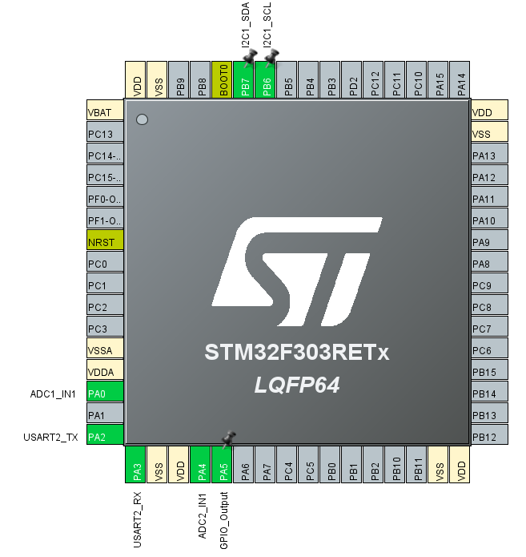

# Firmware - STM32CubeMX Configuration

> Tested on **STM32F303RETx (Nucleo-64)**. Pin assignments may differ on other boards.

The included `firmware.ioc` is the CubeMX project file for the reference board. Open it in STM32CubeMX to view or regenerate the HAL initialization code. If you are using a different STM32 variant, create a new CubeMX project for your chip and configure the peripherals listed below.



| Peripheral | Settings | Pins | Purpose |
|------------|----------|------|---------|
| I2C1 | Fast Mode 400kHz | PB6 (SCL), PB7 (SDA) | MPU9250 gyroscope |
| USART2 | 115200 baud, 8N1, Async | PA2 (TX), PA3 (RX) | Serial output to PC (internally routed to ST-Link on Nucleo — no wiring needed) |
| DMA1 Ch7 | Memory→Periph, Byte, Normal | — | Non-blocking USART2 TX (ping-pong double buffer) |
| TIM6 | Prescaler=79, Period=499 | — | 200Hz sampling timer (5.000ms precise) |
| ADC1 | IN1 Single-ended, 12-bit | PA0 | Vertical EOG |
| ADC2 | IN1 Single-ended, 12-bit | PA4 | Horizontal EOG |
| GPIO Output | Push-Pull, No Pull | PA5 | LED indicator |

## CubeMX Code Regeneration

CubeMX regeneration **overwrites** `main.c` outside of `USER CODE` blocks. After regenerating, add the following includes inside the `/* USER CODE BEGIN Includes */` block:

```c
/* USER CODE BEGIN Includes */
#include "mpu9250.h"   // IMU driver
#include <stdio.h>     // snprintf
#include <string.h>    // memcpy (if needed)
/* USER CODE END Includes */
```

Then copy the application logic (ADC reads, I2C read, DMA UART transmit, TIM6 timing) from the reference `main.c` into the corresponding `USER CODE` blocks in the regenerated file:

| Block | Content to add |
|-------|---------------|
| `USER CODE BEGIN PV` | `tx_buf[2][80]` ping-pong buffers, `dma_busy`, `tick_200hz`, `gyro_data` |
| `USER CODE BEGIN 2` | MPU9250 init + startup delay + `HAL_TIM_Base_Start_IT(&htim6)` |
| `USER CODE BEGIN WHILE` | Main loop body (wait TIM6 flag + ADC + I2C + snprintf + DMA transmit) |

> **Tip:** Before regenerating, back up your working `main.c`. Diff it against the new one to see exactly what CubeMX changed.

## AD8232 Evaluation Board Wiring

| AD8232 Board Pin | Connect To | Notes |
|------------------|-----------|-------|
| **3.3V** | Nucleo 3.3V | Power supply |
| **GND** | Nucleo GND | Common ground |
| **OUTPUT** | STM32 ADC pin | Analog EOG signal |
| **RA** | Electrode (−) | Inverting input |
| **LA** | Electrode (+) | Non-inverting input |
| **RL** | Electrode (REF) | Reference / right leg drive |

- AD8232 #1 (Vertical EOG): **OUTPUT → PA0** (ADC1), RA = below eye, LA = above eye, RL = forehead
- AD8232 #2 (Horizontal EOG): **OUTPUT → PA4** (ADC2), RA = right outer canthus, LA = left outer canthus, RL = forehead

## Serial Debug Notes

### Port Name

| OS | Port | Notes |
|----|------|-------|
| Linux | `/dev/ttyACM0` | Nucleo boards use CDC ACM driver. Check with `ls /dev/ttyACM*` |
| Windows | `COM4` (varies) | Check Device Manager → Ports (COM & LPT) |
| macOS | `/dev/cu.usbmodemXXXX` | Check with `ls /dev/cu.usb*` |

### Common Issues

1. **"Port busy" / "Access denied"**
   - **Only one program can hold the serial port at a time.** Close STM32CubeIDE's Serial Terminal before running the Python script, and vice versa.
   - On Linux, add your user to the `dialout` group: `sudo usermod -aG dialout $USER` (then log out and back in).

2. **No data / garbled output**
   - Verify baud rate matches: firmware sends at **115200 baud, 8N1**.
   - After flashing new firmware, **reset the board** (press the black reset button on Nucleo) to ensure the new code runs.
   - Unplug and replug USB if the virtual COM port is stuck.

3. **Verifying data format**
   - Use a serial terminal (e.g., CubeIDE Serial Terminal, PuTTY, `screen /dev/ttyACM0 115200`) to check raw output.
   - Expected format: `timestamp,eog_v,eog_h,gyro_x,gyro_y,gyro_z\r\n`
   - Example: `12345,2048,2048,150,-80,30`
   - If you see only 5 fields, the firmware may be running the legacy single-channel format.

4. **IMU reads all zeros**
   - Check I2C wiring: SDA → PB7, SCL → PB6.
   - Verify MPU9250 address (0x68 or 0x69 depending on AD0 pin).
   - If `imu_ok = 0`, the LED on PA5 will light up as a warning.

5. **ADC disabled (EOG hardware not connected)**
   - If EOG hardware is not yet available, replace the ADC read blocks in `main.c` with fixed values:
     ```c
     uint16_t eog_v = 2048;
     uint16_t eog_h = 2048;
     ```
   - The Python side will see baseline values and no blink/gaze events will trigger.
